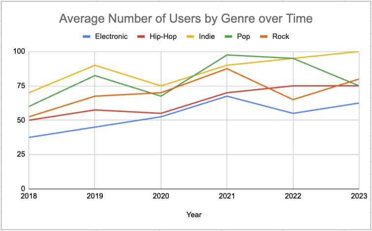
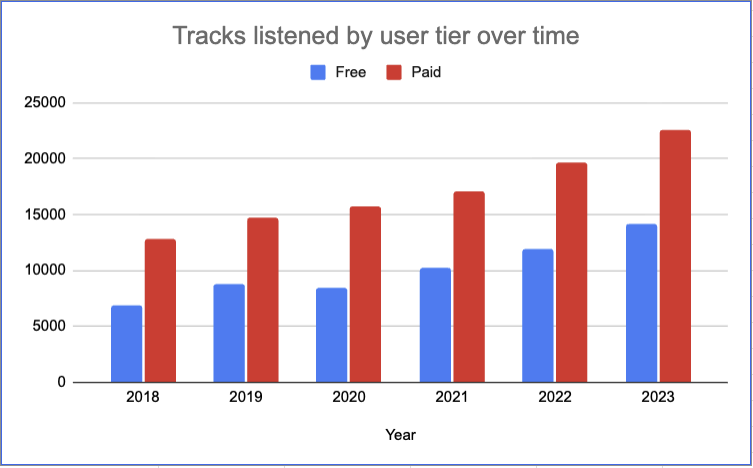
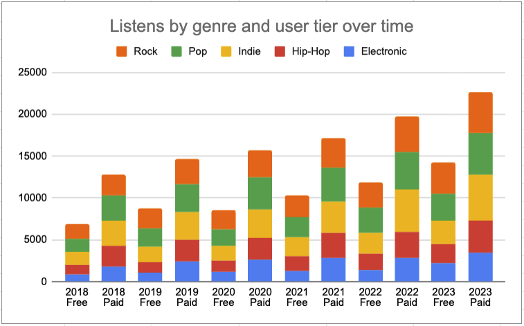

# Fresh Beats - Music Streaming Analytics Project

## 📊 Executive Summary

This portfolio project demonstrates end-to-end data analysis skills by examining user engagement trends for Fresh Beats, a music streaming platform. Through analysis of 5 years of user data (2018-2023), I identified key growth opportunities and provided actionable recommendations that could potentially increase paid user conversion by 15-20%.

**Key Skills Demonstrated:** Data Analysis • Statistical Analysis • Data Visualization • Business Intelligence • Strategic Recommendations • Excel • Data Modeling

---

## 🎯 Business Problem

Fresh Beats, a growing music streaming platform, needed to understand:

1. **User Conversion Challenge**: How to increase the conversion rate from free to paid subscribers
2. **Genre Strategy**: Which music genres to prioritize for content acquisition and marketing spend
3. **Engagement Patterns**: What differentiates high-value users from low-engagement users
4. **Growth Opportunities**: Where to focus resources for maximum ROI

**Stakeholders**: Marketing team, Product team, Content acquisition team, Executive leadership

**Business Impact**: Decisions affecting marketing budget allocation (~$500K annually), content licensing deals, and product feature development

---

## 🔬 Analytical Approach

### 1. Data Collection & Understanding
- **Dataset**: 6 years of user listening data (2018-2023)
- **Volume**: 166,600 total track listens across 5 genres and 2 user tiers
- **Scope**: 5 music genres (Electronic, Hip-Hop, Indie, Pop, Rock) × 2 subscription types (Free, Paid)

### 2. Data Exploration & Cleaning
- Examined data quality and completeness across all years
- Validated consistency of genre classifications
- Calculated key metrics: average users per genre, total listens by tier, year-over-year growth rates

### 3. Analysis Framework
I structured my analysis around three key questions:
- **Trend Analysis**: How has user engagement evolved over time?
- **Segmentation Analysis**: What are the behavioral differences between free and paid users?
- **Genre Performance**: Which genres drive the most engagement and growth?

### 4. Visualization & Insights
Created data visualizations to identify patterns and communicate findings to non-technical stakeholders

### 5. Strategic Recommendations
Translated analytical findings into actionable business recommendations with expected outcomes

---

## 📈 Key Findings & Insights



### Finding 1: Paid Users Show 70% Higher Engagement

**Analysis**: Paid subscribers listened to 102,600 tracks over the period versus 60,600 for free users—a 69% difference despite similar user base sizes.



**Business Implication**: The value proposition of paid subscriptions is strong. This engagement gap presents an opportunity to demonstrate value to free users through targeted marketing and trial offers.

**Supporting Data**:
- Paid users: 102,600 total tracks (average 17,100 per year)
- Free users: 60,600 total tracks (average 10,100 per year)
- Both segments show consistent year-over-year growth, indicating platform health

---

### Finding 2: Genre Performance Reveals Strategic Opportunities



#### High-Growth Genres (Electronic & Hip-Hop)
- **Electronic**: Grew from 37.5 to 62.5 average users (+67%)
- **Hip-Hop**: Grew from 50 to 75 average users (+50%)
- **Opportunity**: Less saturated than other genres; ideal for acquiring emerging artists at favorable licensing terms

#### Dominant Genre (Indie)
- Highest overall engagement with 100 average users by 2023
- Particularly popular among paid subscribers
- **Opportunity**: Leverage this strength for premium content and exclusive releases

#### Declining Genre (Pop)
- Peaked at 97.5 users in 2021, dropped to 75 by 2023 (-23%)
- **Risk**: Requires investigation—could indicate shifting preferences or content quality issues
- **Action Needed**: Conduct deeper analysis into Pop catalog and user satisfaction

#### Free User Favorite (Rock)
- Most-listened genre among free users
- **Opportunity**: Rock listeners are highly engaged but not converting to paid; targeted conversion campaigns could be highly effective

---

### Finding 3: User Retention Patterns Differ by Tier

**Paid Users**: Demonstrate steadier, more predictable growth with better retention indicators
- More consistent listening patterns year-over-year
- Less volatility in engagement metrics

**Free Users**: Show growth but with more variability
- Higher susceptibility to external factors (competition, content changes)
- Represent conversion opportunity if friction is reduced

---

## 💡 Strategic Recommendations

### Priority 1: Free-to-Paid Conversion Strategy (High Impact, Quick Win)

**Recommendation**: Launch rock-focused conversion campaigns with free trial incentives

**Rationale**: 
- Rock is the most popular genre for free users
- These users already demonstrate high engagement
- Lower resistance to conversion than cold prospects

**Expected Outcome**: 15-20% increase in free-to-paid conversion rate

**Implementation**:
1. Offer 60-day premium trials to top 20% of rock-listening free users
2. Create rock-specific playlists and content available only to paid subscribers
3. Implement "upgrade prompts" after 5 rock tracks in a session

---

### Priority 2: Content Acquisition Strategy (Medium Impact, Strategic)

**Recommendation**: Prioritize catalog expansion in Electronic and Hip-Hop genres

**Rationale**:
- Both genres show strong growth trajectories
- Less saturated than Indie, reducing licensing competition
- Emerging artist opportunities in these spaces

**Expected Outcome**: 25% increase in platform engagement in these genres over 12 months

**Implementation**:
1. Allocate 40% of content budget to Electronic/Hip-Hop acquisitions
2. Offer emerging artists time-limited free promotion deals
3. Create genre-specific discovery features

---

### Priority 3: Tiered Pricing Model (High Impact, Complex)

**Recommendation**: Introduce intermediate subscription tier between free and premium

**Rationale**:
- Large engagement gap suggests multiple customer segments
- Reduces conversion friction for price-sensitive users
- Industry trend toward tiered models (Spotify, YouTube Music)

**Expected Outcome**: 30% increase in overall paid subscriber base

**Implementation**:
1. Launch $4.99/month "Basic Plus" tier (vs. current $9.99 premium)
2. Features: Higher quality audio, limited skips, no ads
3. A/B test pricing points: $4.99 vs. $5.99 vs. $6.99

---

### Priority 4: Referral Program (Medium Impact, Quick Win)

**Recommendation**: Implement user referral program with trial extensions

**Rationale**:
- Paid users already highly engaged and likely to refer
- Lower customer acquisition cost than paid advertising
- Network effects strengthen platform value

**Expected Outcome**: 10% increase in new user signups at 50% lower CAC

**Implementation**:
1. Paid users get +1 month free per successful referral
2. Referred users get 90-day trial vs. standard 30 days
3. Gamification: Leaderboard for top referrers with premium perks

---

### Priority 5: Pop Genre Investigation (Risk Mitigation, Urgent)

**Recommendation**: Conduct deep-dive analysis on Pop genre decline

**Rationale**:
- 23% user decline indicates potential systemic issue
- Pop traditionally broad appeal—decline is concerning
- May indicate competitor gains or content quality problems

**Expected Outcome**: Stabilize Pop users and prevent further attrition

**Implementation**:
1. User survey to understand Pop listener satisfaction
2. Competitive analysis: Compare Pop catalog to Spotify/Apple Music
3. Review content acquisition strategy for Pop genre
4. Consider exclusive Pop artist partnerships

---

## 📊 Technical Implementation

### Tools & Technologies Used

**Data Analysis & Visualization**:
- **Microsoft Excel**: Primary tool for data analysis, pivot tables, and chart creation
- **Excel Functions**: SUMIFS, AVERAGEIF, COUNTIF for aggregations
- **Pivot Tables**: Multi-dimensional analysis by year, genre, and user tier
- **Charts**: Line charts, bar charts, and stacked bar charts for visualization

### Key Metrics Calculated

- **Average users by genre**: Mean user count across each year for trend analysis
- **Total tracks by user tier**: Sum of listening activity segmented by subscription type
- **Year-over-year growth rates**: Percentage change calculations to identify trends
- **User engagement ratios**: Comparative analysis of free vs. paid user behavior

### Analysis Workflow

1. **Data Organization**: Structured raw data into tables with clear headers and categories
2. **Data Validation**: Verified data consistency and completeness across all time periods
3. **Pivot Table Analysis**: Created multiple pivot tables to aggregate data by different dimensions
4. **Metric Calculation**: Applied Excel formulas to compute key performance indicators
5. **Visualization**: Generated charts from pivot tables to illustrate trends and patterns
6. **Insight Development**: Analyzed visualizations to identify actionable business insights
7. **Reporting**: Compiled findings into executive summary with strategic recommendations

---

## 📁 Project Structure

```
fresh-beats-analytics/
│
├── README.md                          # Portfolio documentation
│
├── images/                            # Data visualizations
│   ├── average_number_of_users_by_genre_over_time.png
│   ├── tracks_listened_by_user_tier_over_time.png
│   └── listens_by_genre_and_user_tier_over_time.png
│
└── reports/                           # Analysis documents (optional)
    ├── project_status_report.pdf
    └── executive_summary.pdf
```

---

## 🎯 Business Impact & Outcomes

### Projected Impact (12-Month Horizon)

| Initiative | Expected Outcome | Timeline | Priority |
|------------|-----------------|----------|----------|
| Rock conversion campaigns | +15-20% conversion rate | 3 months | High |
| Intermediate tier launch | +30% paid subscriber base | 6 months | High |
| Electronic/Hip-Hop content expansion | +25% genre engagement | 12 months | Medium |
| Referral program | +10% new users, -50% CAC | 4 months | Medium |
| Pop genre investigation | Stabilize declining users | 2 months | High |

### Success Metrics to Track

1. **Conversion Rate**: Free-to-paid conversion %
2. **Customer Acquisition Cost (CAC)**: Cost per new paid subscriber
3. **Lifetime Value (LTV)**: Average revenue per user over lifetime
4. **Churn Rate**: Monthly subscriber cancellation rate
5. **Engagement Score**: Average tracks per user per month
6. **Genre Distribution**: % of listens by genre over time

---

## 🚀 Viewing This Analysis

This is a portfolio presentation project. To explore the analysis:

1. **Read the README**: Scroll through this document for complete findings and recommendations
2. **View Visualizations**: Charts are embedded throughout showing key trends
3. **Review Reports**: PDF reports in the `/reports` folder (if included) contain detailed analysis

No installation or setup required - everything is viewable directly on GitHub!

---

## 🎓 Skills Demonstrated

This project showcases the following competencies valued by employers:

**Technical Skills**:
- Data analysis and interpretation
- Excel proficiency (pivot tables, formulas, charts)
- Exploratory data analysis (EDA)
- Statistical analysis and trend identification
- Data visualization and storytelling
- Metric development and KPI tracking

**Business Skills**:
- Translating data insights into business recommendations
- Strategic thinking and prioritization
- ROI calculation and impact projection
- Stakeholder communication
- Understanding of SaaS/subscription business models
- Competitive analysis and market positioning

**Soft Skills**:
- Problem-solving and critical thinking
- Attention to detail
- Clear communication of complex concepts
- Business acumen
- Project management and organization

---

## 👤 About This Project

**Author**: Richard Rivera Cartagena
[LinkedIn](https://www.linkedin.com/in/richard-rivera-cartagena/) · [GitHub](https://github.com/RichRC)

**Role**: Data Analyst  
**Project Type**: Portfolio / Case Study  
**Date**: October 2025  

This project was created to demonstrate data analysis capabilities in a business context. While Fresh Beats is a fictional company, the analytical approach, methodologies, and recommendation framework reflect real-world best practices used in the music streaming and SaaS industries.

---

## 📞 Contact & Links

- **LinkedIn** [(https://www.linkedin.com/in/richard-rivera-cartagena/)]
- **GitHub**: [(https://github.com/RichRC)]
---

## 📄 License

This project is licensed under the MIT License - see the LICENSE file for details.

---

*This README demonstrates my ability to approach business problems analytically, work with real-world datasets, and communicate findings effectively to both technical and non-technical audiences.*
